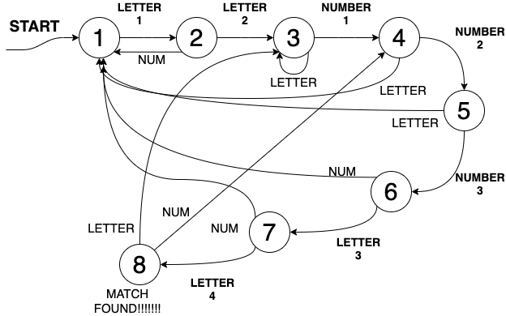

# lexical_analyzer_coding_challenge
Consider the string:  C11111AA111BB111AA111111BB111111AA111BB111111AA11D  

It's a random string with a pattern in it. Find double letters that are spaced by 3 digits.

## Draw State Diagram

Starting at state 1, you read in a letter at a time.

For each state, you have two options. Either you read in a letter, or you read in a number.

If you read in the wrong thing, you usually have to go back to the beginning of the whole state machine.

Note that in the code, the functions are named "one()" through "eight()" corresponding to the 8 states in the digram.

## Code
The code resembles a typical implementation of a state diagram. The only difference is python's lack of switch statements. I had to implement that manually.

## Generalization
To generalize this to N letters with M numbers in between, you only need to add a counter in one of the number states to see how many numbers you've seen. You also need to add an array of size N where you keep the latest N letters in memory and forget the rest.

